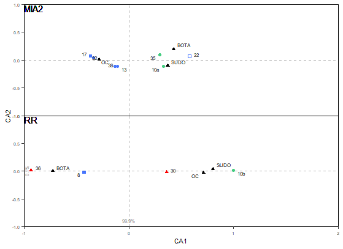

[](https://zenodo.org/badge/latestdoi/394916563)

# ***zoowork*** R package <br> Methods for Archaeozoology 
> Thomas Huet, Ariadna Nieto-Espinet

***Zoowork*** R package aims to gives functions to handle large archaeozoological datasets, like for [this study](https://journals.plos.org/plosone/article?id=10.1371/journal.pone.0246201)

## Install

Install the package from GitHub into R:

```
devtools::install_github("zoometh/zoowork")
```

## Principal functions

### zoo_legends


Read a XLSX file of legend and plot them

### zoo_ca

Compute Correspondance Analysis on NISP



```
df <- zoo_read()
lorder_period <- zoo_order_period(df)
typsit_symb <- zoo_legends(worksheets = c("sites_types"))
zoo_ca(df = df, lorder_period = lorder_period, typsit_symb = typsit_symb)

```

### zoo_isotops


Plot the isotope dataset in a grid layout without confidence intervals

```
zoo_isotops(img.layout = "grid",
            iso.colors = c("red", "blue"),
            stat.ci = FALSE,
            img.format = ".png")
```

Align the different plot with confidence intervals and defaults colors

```
zoo_isotops(img.layout = "align",
            img.title = "O and Sr isotopic variations"
)
```

### zoo_hc

Hierarchical clustering on NISP distributions (coming soon)
